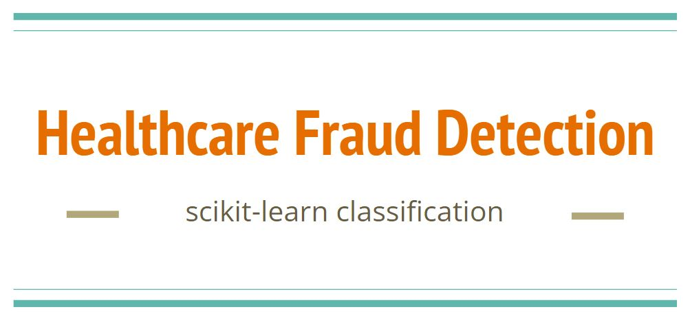
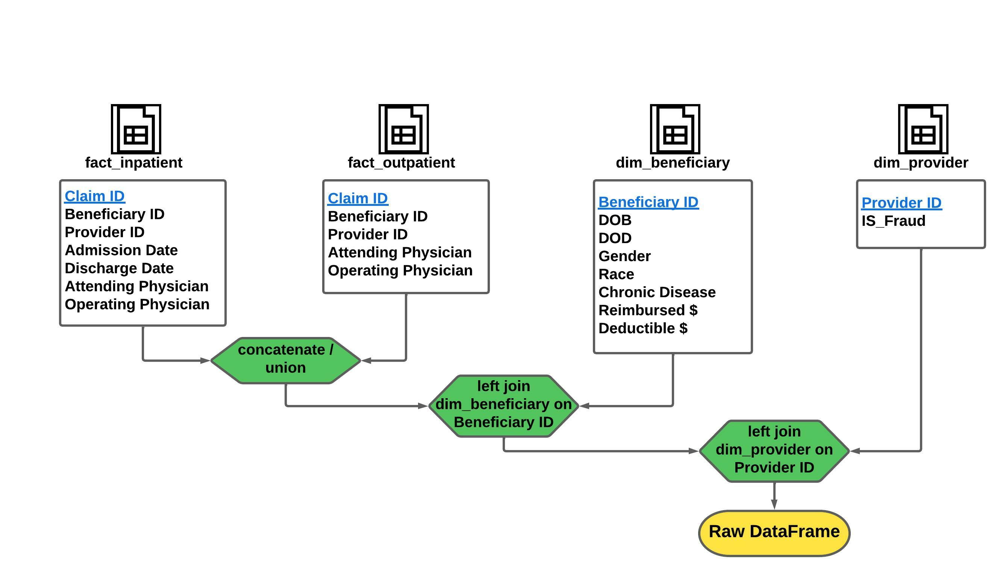
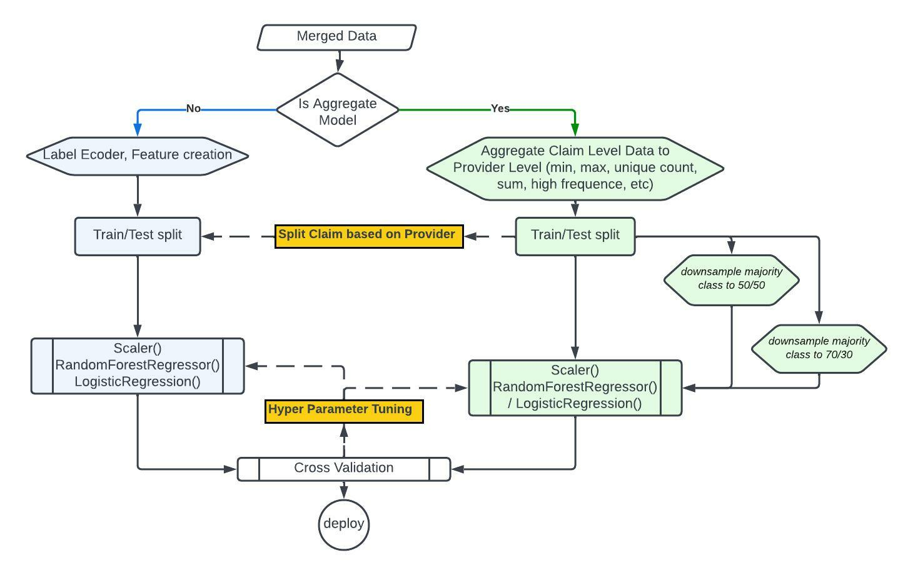

**Classification** - predict the potentially fraudulent providers based on the healthcare claims filed

* **Data Source** [Kaggle - Healthcare Provider Fraud Detection Analysis](https://www.kaggle.com/datasets/rohitrox/healthcare-provider-fraud-detection-analysis)
* **Features** Claim Dates, Doctor IDs, Patient info (DOB, DOD, Gender, Chronicle Conditions..), Procedure Codes, Diagnosis Codes, Reimbursement Amount, Deductible Amount, Geo Locations, Length of Hospital Stay
* **Target** y for each provider (0 - Not Potential Fraud, 1 - Potential Fraud) 
* **Outcomes** 
    * Identify important variables in detecting the behavior of potentially fraud providers
    * Label potential fraud providers 
    * Study fraudulent patterns in the provider's claims
* **Performance Metrics**
    * F1-score
    * ROC AUC
	
## EDA
**Data Model** - merge and union data to prepare the dataframe

## Bench Model

## Model

## App